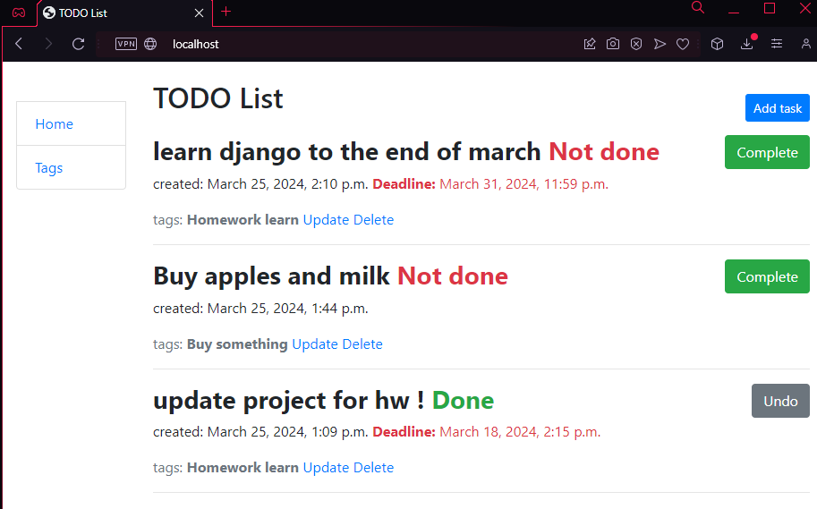

# TODO list
This application will help you manage your tasks in more detail by allowing you to monitor approaching deadlines (if any) as well as track the status of the task

## How to install:
```shell
git clone https://github.com/Shantagust/todo-list.git
cd todo
python3 -m venv venv
source venv/bin/activate
pip install -r requirements.txt
python3 manage.py runserver localhost
```

## Features 

* Create\update\delete tags for task
* Create\update\delete task with tags and deadlines(not necessary parameter)
* Easy task status switching in one click
* Sorting tasks (first open task, then closed)

## Demo:
